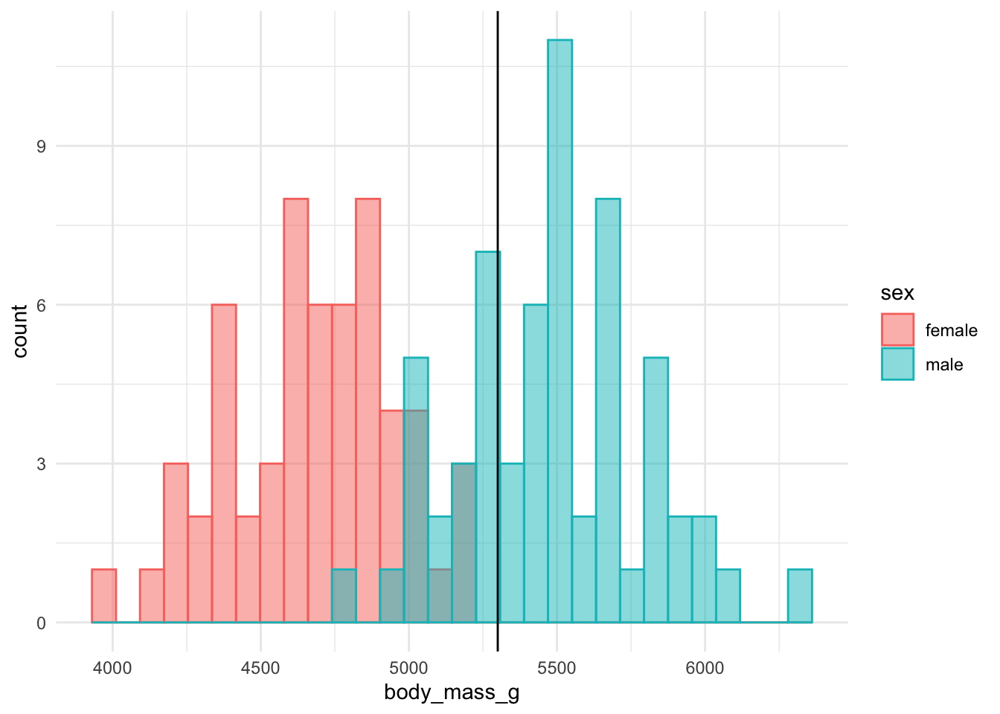
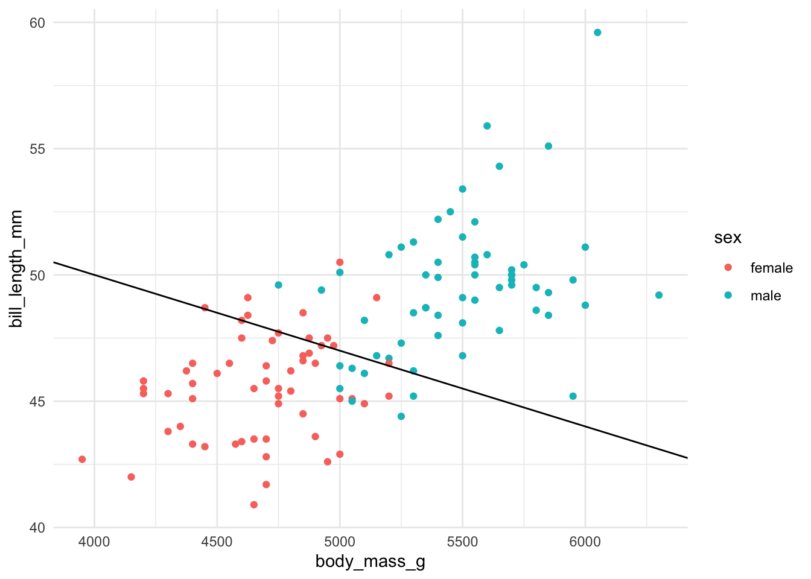
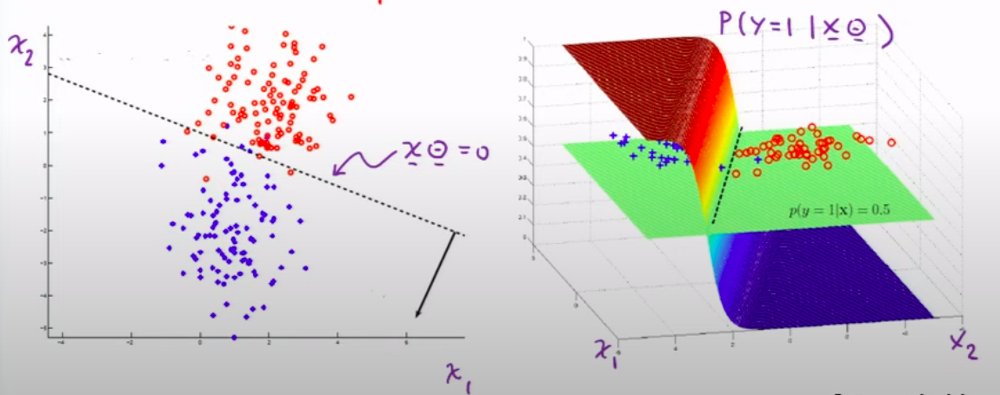

# Modelado

Tres elementos de la tarea de modelado

1.  Representación
2.  Evaluación
3.  Optimización

Usando el dataset penguins del paquete palmerpenguins queremos crear un modelo que permita estimar el largo del pico conociendo el peso de los pingüinos.

> $x$: Peso del pingüino
>
> $\hat y$: Largo del pico

En principio vamos a trabajar sólo con los pingüinos de la especie Gentoo.

Antes de empezar a construir el modelo, grafiquen! Hagan un scatter plot del largo del pico en función del peso para los pingüinos Gentoo.

```{r}
library(dplyr)
library(tidyverse) # Para usar drop_na()
library(ggplot2)
library(palmerpenguins)

head(penguins)
```

```{r}
datos <- penguins %>% 
    rowwise() %>% 
    mutate(species = toString(species)) %>% 
    filter(species == "Gentoo") %>% 
    select(bill_length_mm, body_mass_g) %>% 
    drop_na()

datos %>% 
    ggplot(aes(body_mass_g, bill_length_mm)) +
        geom_point()
```

El primer paso es la representación o especificación del modelo. Es decir, definir cómo se relacionan las variables largo de pico y peso según el modelo. En este caso vamos a usar una función lineal. ¿Tiene sentido proponer este modelo de acuerdo a cómo se ven los datos en el gráfico que hicieron?

Aunque este problema se puede resolver con la función ´lm()´, entre otras, en este caso vamos a hacer explícitos los tres pasos que requiere el modelado.

## 1. Representación

> Crear una función que tenga como inputs la ordenada al origen, la pendiente y el peso, y como output el largo del pico.

```{r}
modelo.lineal <- function(x, ordenada=0, pendiente=1){
    y <- pendiente * x + ordenada
    return (y)
}
```

```{r}
#set.seed(42)

a <- runif(1, min=-1, max=1)
b <- runif(1, min=0, max=1)

xs <- c(0,1)

ys <- modelo.lineal(xs, b, a)


plot(xs, ys,
    xlim = c(0, 1),
    ylim = c(-2, 2),
    type = 'l',
    main = paste0("Función: ", round(a, 2), " x + ", round(b, 2))
    )
grid()

```

## 2. Evaluación

> El siguiente paso es la evaluación. Es decir, dado un modelo con sus parámetros, queremos conocer una medida del ajuste del modelos a los datos.
>
> Para eso vamos a crear una función que tenga como inputs la variable a explicar (largo del pico) y las predicciones del modelo.
>
> La llamamos función de pérdida (`fun_loss`) y en este caso queremos que devuelva la raíz cuadrada del error cuadrático medio (*RMSE*). Noten que la función de pérdida podría ser otra.

```{r}
root.mean.squared.error <- function(y.real, y.pred){
    e <- sum( (y.real - y.pred) ^ 2 )
    return (e)
}
```

```{r}
root.mean.squared.error(c(1, 2, 3), c(0, 0, 0))
```

## 3. Optimización

> Por último, la optimización. Es decir, cómo vamos a encontrar los parámetros que minimizan la función de pérdida.
>
> En este caso vamos a usar un método de **optimización aleatoria**. Es decir, queremos una función que:
>
> \* defina valores iniciales de parámetros `(a, b)` y un rango inicial de cada parámetro.
>
> \* evalúe el *RMSE* inicial.
>
> \* sortee nuevos parámetros dentro de la región definida y evalúe el *RMSE* para estos nuevos parámetros.
>
> \* si el *RMSE* disminuye, tomo los nuevos valores de `(a,b)` y si no achico la región de búsqueda.
>
> \* Cuando la región de búsqueda es lo suficientemente chica, termina y devuelve los parámetros finales.

```{r}
set.seed(42)
optim.aleatoria <- function(datos,
                            loss.fun=root.mean.squared.error,
                            pendiente.ini=0.01,
                            ordenada.ini=1,
                            rango.pendiente = 10,
                            rango.ordenada = 100){
  facred <- 0.9999  # factor de reduccion de la ventana
  facred.acu <- 1   # factor de reduccion acumulado
  toler <- 1e-6     # umbral de tolerancia
  
  # Parametros mejores
  mejor.pendiente <- pendiente.ini
  mejor.ordenada <- ordenada.ini
  
  y.real <- datos$bill_length_mm
  y.pred <- modelo.lineal(x = datos$body_mass_g,
                          ordenada = mejor.ordenada,
                          pendiente = mejor.pendiente)
  
  error.eval <- loss.fun(y.real, y.pred)
  mejor.eval <- error.eval
  mejores <- matrix(c(mejor.eval, pendiente.ini, ordenada.ini, 1), 1, 4)
  k <- 0    # indice de iteracion
  actu <- 0 # indice de actualizacion
  
  # Historiales para graficar luego
  pendiente.hist <- c()
  ordenada.hist <- c()
  
  while (facred.acu > toler)
  {
    k <- k + 1
    
    # Genero nuevos valores aleatorios
    pendiente <-
      runif(1,
            mejor.pendiente - rango.pendiente * facred.acu,
            mejor.pendiente + rango.pendiente * facred.acu)
    ordenada <-
      runif(1,
            mejor.ordenada - rango.ordenada * facred.acu,
            mejor.ordenada + rango.ordenada * facred.acu)

    # Evaluación de los nuevos valores
    y.pred <- modelo.lineal(x = datos$body_mass_g,
                            ordenada = ordenada,
                            pendiente = pendiente)
    error.eval <- loss.fun(y.real, y.pred)
    
    #cat(valor, "\n\n", y.pred, "\n\n", y.real, "-------------------- \n\n")
    #print(data.frame(y.real, y.pred))
    #cat("Error:", valor)
    #invisible(readline(prompt=paste0(k, " - Presione [enter] para seguir:")))
    
    if (error.eval < mejor.eval)
    {
      # Si encuentro algo mejor -> Actualizacion
      actu <- actu + 1
      
      mejor.eval <- error.eval
      mejor.pendiente <- pendiente
      mejor.ordenada <- ordenada
      
      pendiente.hist <- c(mejor.pendiente, pendiente.hist)
      ordenada.hist <- c(mejor.ordenada, ordenada.hist)
      
      mejores <- rbind(mejores, c(mejor.eval, mejor.pendiente, mejor.ordenada, k))
    }
    else
    {
      # Si NO encuentro algo mejor -> Reduzco rango de busqueda
      facred.acu <- facred.acu * facred
    }
  }
  #all.hist <- data.frame(mejor.eval, pendiente.hist, ordenada.hist)
  all.hist <- data.frame(pendiente.hist, ordenada.hist)
  return (list(mejores, all.hist))
}
```

Mas detalles en el [apunte](https://guillermosolovey.github.io/laboratoriodedatos2021-2C/NotebooksTeoricas/Modelado/Modelado_con_Regresion_Lineal_Multiple_Final.pdf) y [videos](https://youtube.com/playlist?list=PLN2e9R_DoC0THQgbage3DkS_7tCsqTd-3) de Andres Farall. El factor de reduccion y la tolerancia pueden estar definidas por defecto en la funcion. Por ejemplo, ´0.95´ y ´1e-10´ respectivamente. Tenga en cuenta que esta función tiene que llamar a las otras dos funciones creadas anteriormente.

## Automatización

d- Usando las 3 funciones creadas, armar un script que cargue los datos, ajuste el modelo, devuelva los parámetros óptimos y grafique los datos y la recta estimada por el modelo.

```{r}
resul <- optim.aleatoria(datos = datos)
resul
```

```{r}
mejor.params <- resul[[1]][length(resul[[1]][,1]),]
mejor.pendiente <- mejor.params[2]
mejor.ordenada <- mejor.params[3]
```

```{r}
datos %>% 
    ggplot(aes(body_mass_g, bill_length_mm)) +
    geom_point() + 
    geom_abline(aes(slope=mejor.pendiente, intercept=mejor.ordenada), color="steelblue")
```

e- Si repiten el proceso de optimización aleatoria, ¿llegan a la misma solución? Una propiedad importante de un método de optimización es que sea robusto, en el sentido de que los parámetros óptimos que encuentra el método no sean casualidad. Para estudiar esto, repitan el proceso de optimización 100 veces y hagan una descripción de los parámetros estimados. Pueden hacer un histograma de `a` y de `b`. Estudien también si los valores estimados dependen de los valores iniciales para `a` y `b`.

TODO: Completar haciendo un analisis de los parametros "descubiertos" por el algoritmo aleatorio

```{r}
pendientes <- c()
ordenadas <- c()
errores <- c()
iteraciones <- c()
cat("   Error   \tPendiente \tOrdenada\n")
for(i in 1:10){
  resul <- optim.aleatoria(datos = datos)
  
  mejor.params <- resul[[1]][length(resul[[1]][,1]),]
  
  pendientes <- c(pendientes, mejor.params[2])
  ordenadas <- c(ordenadas, mejor.params[3])
  
  errores <- c(errores, mejor.params[1])
  iteraciones <- c(iteraciones, mejor.params[4])
  
  cat(i, ". ", mejor.params[1], "\t", mejor.params[2], "\t", mejor.params[3], "\n", sep="")
}
```

f- ¿Cuál es el método de optimización que usa la función `lm`? Comparen los parámetros estimados con el método de optimización aleatoria en e- con los que se obtienen con la función `lm`. Si el método funciona bien, un histograma de los parámetros estimados con el método de optimización aleatoria debería incluir a los valores estimados con la función `lm`.

Rta: Los sistemas lineales con mínimos cuadrados se resuelven de manera analítica, derivando e igualando a cero:

$$\theta = \left( \  X^T X \  \right )^{-1} \ X^T y$$

```{r}
lm.params <- coef(lm(bill_length_mm ~ body_mass_g, datos))
lm.params
```

```{r}
hist(pendientes, xlab = "Pendiente", col="steelblue")
abline(v=lm.params[[2]], col="red")
legend("topright", "Modelo Lineal", fill="red")
```

```{r}
hist(ordenadas, xlab = "Ordenada", col="steelblue")
abline(v=lm.params[[1]], col="red")
legend("topright", "Modelo Lineal", fill="red")
```

```{r}
hist(errores, xlab = "Error", col="steelblue")
abline(v=mean(errores), col="red")
abline(v=median(errores), col="green")
legend("topright", c("Media", "Mediana"), fill=c("red", "green"))
```

```{r}
hist(iteraciones, xlab = "Iteraciones", col="steelblue")
abline(v=mean(iteraciones), col="red")
abline(v=median(iteraciones), col="green")
legend("topright", c("Media", "Mediana"), fill=c("red", "green"))
```

f- Cambien la función de pérdida por una que calcule el promedio del error absoluto y estudien si los parámetros estimados son compatibles con los que obtuvieron usando como función de pérdida a la raíz cuadrada del error cuadrático medio.

```{r}
mean.absolute.error <- function(y.real, y.pred){
    e <- sum( abs(y.real - y.pred) )
    return (e)
}
```

```{r}
resul.l1 <- optim.aleatoria(datos = datos, loss.fun = mean.absolute.error)

mejor.params.l1 <- resul.l1[[1]][length(resul.l1[[1]][,1]),]
mejor.pendiente.l1 <- mejor.params.l1[2]
mejor.ordenada.l1 <- mejor.params.l1[3]
```

```{r}
datos %>% 
    ggplot(aes(body_mass_g, bill_length_mm)) +
    geom_point() + 
    geom_abline(aes(slope=mejor.pendiente, intercept=mejor.ordenada), color="steelblue") + 
    geom_abline(aes(slope=mejor.pendiente.l1, intercept=mejor.ordenada.l1), color="orange") +
    labs(x = "Masa corporal (gr)",
         y = "Largo del Pico (mm)",
         color = "Legend") +
    theme(legend.position="right")
```

# Clasificación

### Los 3 elementos del modelado en un problema diferente

El objetivo de este ejercicio es crear los 3 elementos de la tarea de modelado para reconocer el sexo de los pingüinos de la especie ***Gentoo*** conociendo sólo la información del peso.

La idea es encontrar una forma de [**separar**]{.ul} a los pingüinos masculinos y femeninos. Vamos a usar lo siguiente:

1.  **representación**: Sólo usaremos la variable `peso`

    > Si `peso > p0` es masculino.
    >
    > Sino, es femenino.

2.  **evaluación**: error de clasificación (# de pingüinos mal clasificados)

3.  **optimización**: optimización aleatoria.

Por ejemplo, en la figura de abajo se muestra un ejemplo usando como peso de corte `p0 = 5300` gramos.



## a. Mejor punto de corte

> Ustedes tienen que encontrar cuál es el **mejor peso** de corte `p0` y cuál es el error para ese **criterio**.

A partir de la variable peso, queremos separar los datos en dos grupos: Femeninos y Masculinos

Mientras antes buscábamos los *parámetros* que mejor **explicaban** los datos (modelado), aquí buscamos el *parámetro* que mejor **separa** los datos (clasificación).

```{r}
datos <- penguins %>% 
    rowwise() %>% # Para usar toString() componente a componente
    mutate(species = toString(species)) %>% 
           #sex = toString(sex)) %>%
    ungroup() %>% # Para deshacer el rowwise
    filter(species == "Gentoo") %>% 
    select(bill_length_mm, body_mass_g, sex) %>% 
    drop_na()
    
datos
```

Visualizando las categorías por separado, podemos diferenciarlas fácilmente, aunque **no** podremos separarlas perfectamente, ya que para cualquier punto de corte `p0`, siempre habrá miembros **de los dos** grupos en al menos alguno de los dos lados del corte:

```{r}
datos %>%
    select(body_mass_g, sex) %>% 
    ggplot(aes(x=body_mass_g, fill=sex)) +
        geom_histogram(alpha=0.5, position="identity")
```

Buscamos que este error de clasificación sea el menor posible.

Codificaremos las categorías en 0 y 1

```{r}
datos <- datos %>%
    rowwise() %>% 
    mutate(sex = toString(sex)) %>% 
    mutate(sex = sex == "male") %>% 
    mutate(sex = as.numeric(sex))
datos
```

#### Representación

```{r}
clasificador <- function(dato, p0){
    # El clasificador responde
    # 0: Femenino
    # 1: Masculino
    return (as.numeric(dato >= p0))
}
```

#### Evaluación

```{r}
sum.errores <- function(y.real, y.pred){
    # Compara una a una las variables
    # Ambas deben ser del mismo tipo
    e <- sum(y.real != y.pred)
    return (e)
}
```

#### Optimización

```{r}
set.seed(42)
optim.aleatoria.1dim <- function(datos.x,
                                 datos.y,
                            loss.fun=sum.errores,
                            p0.ini = 1,
                            rango.p0 = 10){
  facred <- 0.9999  # factor de reduccion de la ventana
  facred.acu <- 1   # factor de reduccion acumulado
  toler <- 1e-6     # umbral de tolerancia
  
  # Parametros mejores
  mejor.p0 <- p0.ini
  
  y.real <- datos.y
  y.pred <- clasificador(datos.x, p0=p0.ini)
  
  error.eval <- loss.fun(y.real, y.pred)
  
  mejor.eval <- error.eval
  
  mejores <- matrix(c(mejor.eval, mejor.p0, 1), 1, 3)
  
  k <- 0    # indice de iteracion
  actu <- 0 # indice de actualizacion
  
  # Historiales para graficar luego
  p0.hist <- c()
  
  while (facred.acu > toler)
  {
    k <- k + 1
    
    # Genero nuevos valores aleatorios
    p0 <-
      runif(1,
            mejor.p0 - rango.p0 * facred.acu,
            mejor.p0 + rango.p0 * facred.acu)

    # Evaluación de los nuevos valores
    y.pred <- clasificador(datos.x, p0)
    
    error.eval <- loss.fun(y.real, y.pred)
    
    #cat("p0:", p0, "\nerror:", error.eval, "\n", y.pred, "\n", y.real, "\n--------------------\n")
    #print(data.frame(y.real, y.pred))
    #cat("Error:", error.eval)
    #invisible(readline(prompt=paste0(k, " - Presione [enter] para seguir:")))
    
    if (error.eval < mejor.eval)
    {
      # Si encuentro algo mejor -> Actualizacion
      actu <- actu + 1
      
      mejor.eval <- error.eval
      mejor.p0 <- p0
      
      p0.hist <- c(mejor.p0, p0.hist)

      mejores <- rbind(mejores, c(mejor.eval, mejor.p0, k))
    }
    else
    {
      # Si NO encuentro algo mejor -> Reduzco rango de busqueda
      facred.acu <- facred.acu * facred
    }
  }
  #all.hist <- data.frame(mejor.eval, pendiente.hist, ordenada.hist)
  all.hist <- data.frame(p0.hist)
  return (list(mejores, all.hist))
}
```

```{r}
#p0.inicial <- median(datos$body_mass_g)
#p0.inicial <- mean(datos$body_mass_g)
p0.inicial <- 4500

res <- optim.aleatoria.1dim(datos.x=datos$body_mass_g,
                            datos.y=datos$sex, loss.fun = sum.errores,
                       p0.ini = p0.inicial,
                       rango.p0 = 100)

res # 
```

```{r}
mejor.p0 <- res[[1]][length(res[[1]][, 2]), 2]
mejor.p0
```

```{r}
datos %>%
    select(body_mass_g, sex) %>% 
    ggplot(aes(x=body_mass_g, fill=as.factor(sex))) +
        geom_histogram(alpha=0.5, position="identity") +
        geom_vline(aes(xintercept=mejor.p0), color="steelblue")
```

a.  Ahora consideren que pueden usar también el largo del pico. Una posibilidad es dividir al plano con una recta como la de la figura de abajo



El ejercicio es montar reemplazar el modelo anterior que usaba sólo el peso por uno que usa también el largo del pico. Es decir:

1.  **representación:** si `y > a + b x` es masculino. si no, es femenino.

2.  **evaluación:** error de clasificación (# de pingüinos clasificados mal)

3.  **optimización:** optimización aleatoria.

<!-- -->

c.  ¿Cuánto mejora la clasificación ahora que incluyeron esta otra variable? ¿Qué pasaría si la recta óptima es una recta vertical? ¿Cómo podrían modificar el modelo para que incluya también el caso de una recta vertical?

#### Dos modelos

Una forma de modificar el modelo, es cambiar el orden de dependencia de las variables:

De

> $$y = ax + b$$

A

> $$x = py + q$$

Notar que en el caso de resolución exacta del sistema lineal, si la recta que mejor divide es horizontal o vertical, no tiene solución en alguna de las dos maneras de escribirla.

En el caso de buscar una aproximación, podremos acercarnos al ideal vertical, pero nunca alcanzarlo.

Nada nos asegura que la aproximación pueda ser tan buena como queramos, siendo que al buscar una pendiente tan grande, el algoritmo podría no converger, o en el caso de existir [*regularización*](https://en.wikipedia.org/wiki/Regularization_(mathematics)), los parámetros con valores muy grandes podrían ser severamente penalizados (aportando mucho error al incrementar ligeramente su valor).

#### Puntos en el espacio

Otra solución podría ser representar la recta como dos puntos en el espacio:

> La recta que pasa por $(x_0, y_0)$ y $(x_1, y_1)$

Para obtener su pendiente y ordenada

> $$ y = \frac{\Delta y}{\Delta x} x + b $$
>
> $$ y = \frac{y_1 - y_0}{x_1 - x_0} \ x + b $$

Donde $b$ sale de reemplazar $x$ e $y$ con alguno de los puntos.

Algo a observar, es que con esta forma de representar la recta, debemos aprender **4** parámetros $x_0,y_0,x_1,y_1$ , lo cual es *lo mismo* que aprender dos modelos de 2 variables cada una.

#### Polares

Si queremos reducir el número de parámetros a aprender, podemos representar la recta como un punto $(x_0,y_0)$ y un ángulo $\theta$ (theta).

#### n-dim

```{r}
clasificador.2dim <- function(pendiente, ordenada, p_0s){
    x_0 <- p_0s[,1]
    y_0 <- p_0s[,2]
    return (y_0 > pendiente * x_0 + ordenada)
}
```

```{r}
clasificador.polar <- function(punto, angulo, p_0s){
    # angulo: en radianes
    angulo <- angulo %% 180
    if (angulo < 90){
        pendiente <- tan(angulo) # sin(x)/cos(x)
    }
    else{
        pendiente <- -tan(angulo)
    }
    
    x <- punto[1]
    y <- punto[2]
    
    ordenada <- y - pendiente * x
    
    return (clasificador.2dim(pendiente, ordenada, p_0s))
}
```

```{r}
set.seed(42)
optim.aleatoria.ndim <- function(datos.x,
                                 datos.y,
                            loss.fun=sum.errores,
                            thetas.ini = c(1,1,1),
                            rango.thetas = c(10,10,1)){
  facred <- 0.9999  # factor de reduccion de la ventana
  facred.acu <- 1   # factor de reduccion acumulado
  toler <- 1e-2     # umbral de tolerancia
  
  # Parametros mejores
  mejor.thetas <- thetas.ini
  
  punto <- c(thetas.ini[1], thetas.ini[2])
  angulo <- thetas.ini[3]
  
  y.real <- datos.y
  y.pred <- clasificador.polar(punto, angulo, datos.x)
  
  error.eval <- loss.fun(y.real, y.pred)
  
  mejor.eval <- error.eval
  
  n <- length(mejor.thetas)
  mejores <- matrix(c(mejor.eval, mejor.thetas, 1), 1, 2 + n)
  
  k <- 0    # indice de iteracion
  actu <- 0 # indice de actualizacion
  
  # Historiales para graficar luego
  thetas.hist <- c()
  
  while (facred.acu > toler)
  {
    k <- k + 1
    
    # Genero nuevos valores aleatorios
    thetas <- rep(0, n)
    for(i in 1:n){
        thetas[i] <-
          runif(1,
                mejor.thetas[i] - rango.thetas[i] * facred.acu,
                mejor.thetas[i] + rango.thetas[i] * facred.acu)
    }
    

    # Evaluación de los nuevos valores
    punto <- c(thetas[1], thetas[2])
    angulo <- thetas[3]
    y.pred <- clasificador.polar(punto, angulo, datos.x)
    
    error.eval <- loss.fun(y.real, y.pred)
    
    #cat("p0:", p0, "\nerror:", error.eval, "\n", y.pred, "\n", y.real, "\n--------------------\n")
    #print(data.frame(y.real, y.pred))
    #cat("Error:", error.eval)
    #cat("facred.acu:",facred.acu,"\n")
    #invisible(readline(prompt=paste0(k, " - Presione [enter] para seguir:")))
    
    if (error.eval < mejor.eval)
    {
      # Si encuentro algo mejor -> Actualizacion
      actu <- actu + 1
      
      mejor.eval <- error.eval
      mejor.thetas <- thetas
      
      thetas.hist <- c(mejor.thetas, thetas.hist)

      mejores <- rbind(mejores, c(mejor.eval, mejor.thetas, k))
    }
    else
    {
      # Si NO encuentro algo mejor -> Reduzco rango de busqueda
      facred.acu <- facred.acu * facred
    }
  }
  #all.hist <- data.frame(mejor.eval, pendiente.hist, ordenada.hist)
  all.hist <- data.frame(thetas.hist)
  return (list(mejores, all.hist))
}
```

```{r}
res <- optim.aleatoria.ndim(datos.x=datos[, c("body_mass_g", "bill_length_mm")],
                            datos.y=datos$sex, loss.fun = sum.errores,
                            thetas.ini = c(5000,47,-1),
                            rango.thetas = c(1,1,0.1))

res
```

```{r}
mejor.params <- res[[1]][length(res[[1]][,1]),]
mejor.x0 <- mejor.params[2]
mejor.y0 <- mejor.params[3]
mejor.angulo <- mejor.params[4]
```

```{r}
datos %>% 
    ggplot(aes(body_mass_g, bill_length_mm), col=sex) +
    geom_point() + 
    geom_point(aes(x=mejor.x0, y=mejor.y0), col="red") +
    geom_text(label="_________", angle=tan(mejor.angulo))
    geom_segment(aes(x=mejor.x0, y=mejor.y0),
               arrow=arrow(length = unit(0.1,"cm"),
                           angle=mejor.angulo+90), lineend = "butt")

```

#### Maximum Likelihood


