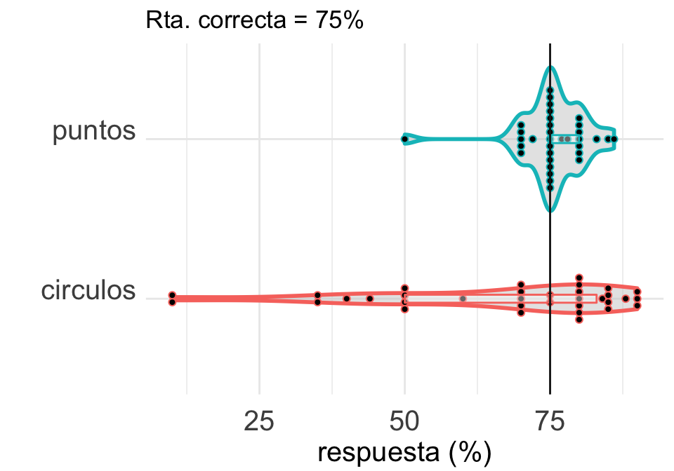

Descripción
En estos ejercicios tienen que integrar dplyr y ggplot2. Además, van a aparecer otros paquetes de tidyverse que los verán anunciados oportunamente o el paquete para trabajar con fechas lubridate.

```{r}
if("tidyverse" %in% rownames(installed.packages()) == FALSE){
  install.packages("tidyverse")
}else{
  cat("tidyverse ya instalado")
}
```

```{r}
require(tidyverse)
```
Ejercicios

1 Datos del experimento de visualización

En la clase de visualización participaron de un experimento. Una de las preguntas era cuál es el área del círculo pequeño respecto del más grande en esta figura:

La respuesta correcta era 75%. La otra pregunta relevante era a qué altura está el punto de abajo, entre 0 y 100, en la siguiente figura:

Las respuestas de ustedes están en esta planilla. Lo primero que tienen que hacer es bajar los datos en un csv y luego leerlos en R con la función read_csv() de tidyverse.

Los datos no están en formato tidy, así que no están preparados para usarse ¿Por qué? Antes de hacer nada, piensen cómo tendrían que verse los datos para que estén en formato tidy.

Usar la función pivot_longer() para transformar los datos a un formato tidy. Llamar al nuevo dataset data.tidy.

```{r}
d <- read.csv("DATOS-EXP-DATOS.csv")
# tienen nombres las variables? si no tienen, pongan un nombre a cada una, tipo 
# circulos y puntos.
d.tidy <- d %>% pivot_longer(cols = 2:3, names_to = "experimento", values_to = "respuesta")
d.tidy
```
Ahora observar con atención el gráfico de abajo y tratar de reproducirlo. Les puede servir algo de lo que está acá: https://www.cedricscherer.com/2019/08/05/a-ggplot2-tutorial-for-beautiful-plotting-in-r/#axes


```{r}
ggplot(data = d.tidy, aes(x = experimento,
                          y = respuesta,
                          color = experimento)) +
    geom_violin(size = 1, alpha = .5) +
    #geom_jitter(alpha = .75, width = .3) +
    geom_dotplot(binaxis="y", stackdir="center", dotsize=1, binwidth=1) +
    geom_boxplot(outlier.alpha=0, alpha=0.4, coef=0, width=.05) +
    geom_hline(yintercept = 75, 
               color = "blue", size=0.5) +
    coord_flip() +
    theme_minimal()
```


2 Reproducir el siguiente gráfico de gapminder

En este ejercicio trabajamos con el dataset que viene en el paquete gapminder. Toda la información sobre este paquete está acá. Básicamente tiene la población, la esperanza de vida y el PBI per cápita para distintos países y durante varios años.

Instalen el paquete y exploren las variables y la documentación para entender un poco más.
```{r}
install.packages("gapminder")
library(gapminder)
```

```{r}
install.packages("lubridate")
library(lubridate)
```

```{r}
require(lubridate)
d.temp <- read_csv("historico_temperaturas.csv")

# usar mutate() y case_when para crear una nueva variable que contenga 
# el número del mes.
# a esa nueva variable llamarla mes.num
# luego con la función make_date, crear la variable fecha
# por último eliminar los datos del año 2020 porque están incompletos.
d <- d.temp %>% 
  mutate( mes.num = case_when( mes == ___ ~ 1,
                               mes == ___,
                               mes == ___,
                               ___)  %>% 
  mutate(fecha = make_date(year = ___, month = as.double(___))) %>% 
  filter( ___ )


ggplot(data = ___, mapping = aes(x = fecha, y = ___, ___)) +
  geom_point() +
  geom_line(___) +
  geom_line(___) +
  labs(___) +
  theme_classic() + 
  theme(axis.text.x = element_text(angle = 45, vjust = 1, hjust = 1, size = 8),
        axis.title.y = element_text(margin = margin(t = 0, r = 20, b = 0, l = 0)),
        plot.margin=unit(c(1,1,1.5,1.2),"cm"),
        strip.text = element_text(face = "bold", color = "black", hjust = 0, size = 8),
        strip.background = element_rect(fill = "gray90", color = "gray")) + 
  facet_wrap(~ año, scales = "free_x") + # que pasa si no ponen scales = "free_x"?
  scale_color_viridis_c(___) 
```

